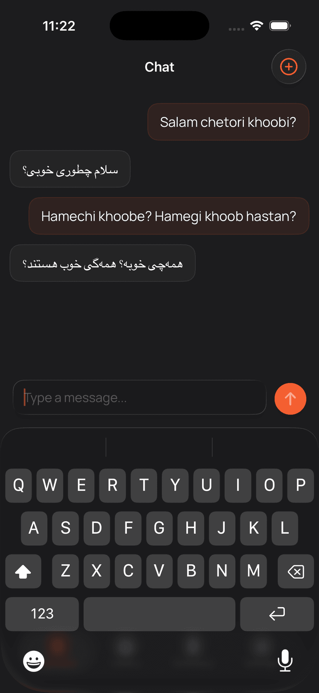

# Translit

**Privacy-first transliteration and translation, powered entirely by on-device AI.**

Translit is an open-source iOS app that helps you transliterate and translate text into native scripts using local Gemma models. After a one-time model download, everything runs on your device — no network required, no data sent to external servers, and no subscriptions.

<p align="center">
  
</p>

## Features

- **On-Device AI** — Transliteration and translation powered by local [Gemma](https://ai.google.dev/gemma) models via [MLX](https://github.com/ml-explore/mlx-swift). No network connection needed after the initial model download.
- **12 Language Scripts** — Arabic, Hebrew, Cyrillic, Devanagari, Bengali, Tamil, Thai, Japanese, Korean, Chinese, Greek, Armenian, and Georgian.
- **Chat-Based Translation** — Type naturally in romanized/Latin text or another language, and get instant conversion to your target script.
- **Conversation History** — Review past translations in a dedicated History tab.
- **Personal Dictionary** — Save, edit, and manage your own vocabulary entries for quick reference.
- **iCloud Sync** — Optional iCloud support for syncing dictionary and history across devices.
- **Privacy by Design** — No analytics, no tracking, no external API keys, and no account required.

## Tech Stack

- **SwiftUI** + **Observation** framework for reactive UI
- **MLX Swift** (`MLXLLM`, `MLXLMCommon`, `MLXLMHFAPI`, `MLXLMTokenizers`) for local LLM inference
- **Swift Package Manager** for dependency management
- **iCloud** via `NSUbiquitousKeyValueStore` for optional sync

## Requirements

- iOS 17.0+
- Xcode 16.0+
- An Apple Developer account (for building to a physical device)
- Sufficient free storage for the on-device model (~2–4 GB depending on the variant)

## Getting Started

### 1. Clone the Repository

```bash
git clone https://github.com/mphassani/Translit-Swift.git
cd Translit-Swift
```

### 2. Open in Xcode

```bash
open Translit.xcodeproj
```

### 3. Resolve Swift Package Dependencies

Xcode should automatically resolve the MLX packages on first open. If not, use **File → Packages → Resolve Package Versions**.

### 4. Build and Run

Select your target device or simulator and press **Cmd+R**.

On first launch, the app will prompt you to download the on-device model. This is a one-time setup step.

## Project Structure

```bash
Translit/
├── AppRoot/
│   └── TranslitApp.swift           # App entry point
├── Constants/
│   └── AppConstants.swift          # Default model IDs and keys
├── Models/
│   ├── ChatMessage.swift           # Conversation message model
│   ├── DictionaryEntry.swift       # Saved vocabulary entries
│   ├── HistoryEntry.swift          # Historical translation entries
│   ├── Language.swift              # Supported language/script definitions
│   └── ...
├── Services/
│   ├── AIService.swift             # MLX LLM inference (chat + system prompts)
│   ├── ChatStorageService.swift    # Local conversation persistence
│   ├── DictionaryStorageService.swift # Vocabulary persistence
│   └── SettingsStorageService.swift # User preferences
├── Store/
│   └── AppStore.swift              # Central @Observable app state
├── Views/
│   ├── Flows/                      # Onboarding & model download flows
│   ├── Root/                       # Root navigation container
│   ├── Shared/                     # Reusable UI components
│   └── Tabs/                       # Main tab views (Translate, History, Dictionary, Settings)
└── Resources/
    └── Fonts/                      # Bundled custom typefaces
```

## Customizing the Model

The default model is `mlx-community/gemma-4-e2b-it-4bit`. You can override it by setting the `TRANSLIT_MODEL_ID` key in your app's Info.plist, or via the `TRANSLIT_MODEL_ID` environment variable at build time. Any [MLX-compatible Gemma](https://huggingface.co/mlx-community) model should work.

## Contributing

Contributions are welcome. Please open an issue to discuss significant changes before submitting a pull request.

1. Fork the repository
2. Create a feature branch (`git checkout -b feature/my-feature`)
3. Commit your changes (`git commit -am 'Add new feature'`)
4. Push to the branch (`git push origin feature/my-feature`)
5. Open a Pull Request

## License

This project is licensed under the [MIT License](LICENSE).

## Acknowledgements

- [MLX Swift](https://github.com/ml-explore/mlx-swift) by Apple / MLSys for on-device machine learning
- [Gemma](https://ai.google.dev/gemma) by Google DeepMind for the open-weight language models
- [Hugging Face](https://huggingface.co/mlx-community) for the MLX-community model conversions
